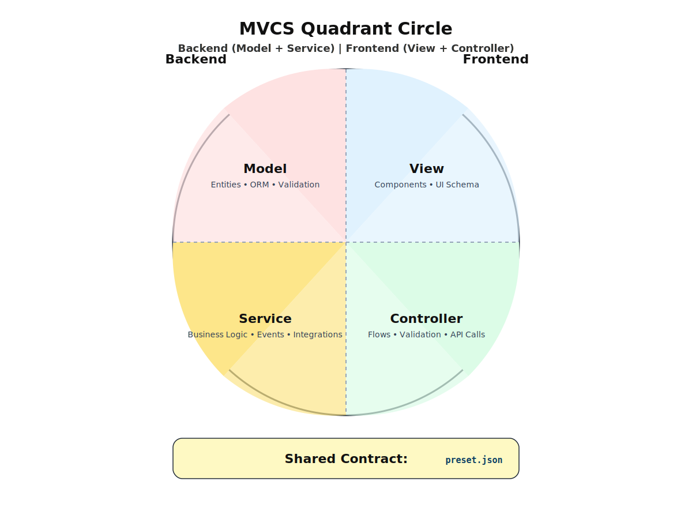

# MVCS Hybrid (Monolithic MVC + Microservices) + JSON Preset

Preset berbasis **JSON Preset** mengatur perilaku UI (komponen, rute, validasi) sekaligus memetakan endpoint **Service** dan skema data **Model** agar front-end bersifat *config-driven*.

---

## 1️⃣ Diagram Alir (Flow Diagram)


**Alur utama:**  
Client → Controller → Service → Model/DB ↔ Microservices → View  
Preset JSON menginjeksikan konfigurasi ke Controller & View.

---

## 2️⃣ Diagram Lingkaran Terbagi Dua (Backend vs Frontend)



| Posisi | Komponen |
|:-------|:----------|
| Atas-kiri | Model |
| Bawah-kiri | Service |
| Atas-kanan | View |
| Bawah-kanan | Controller |

---


## 3️⃣ Contoh JSON Preset (Ringkas)

Preset ini mengatur menu, rute, form, tabel, dan pemetaan endpoint *Service* beserta skema *Model*.

```json
{
  "app": {
    "name": "LMS MVCS",
    "theme": "auto",
    "routes": [
      {
        "path": "/courses",
        "view": "Table",
        "controller": "CourseCtrl",
        "service": {
          "list": "/api/courses",
          "detail": "/api/courses/:id"
        },
        "columns": [
          {"key": "code", "label": "Kode", "type": "string"},
          {"key": "title", "label": "Mata Kuliah", "type": "string"},
          {"key": "credits", "label": "SKS", "type": "number"}
        ],
        "actions": [
          {"type": "create", "method": "POST", "endpoint": "/api/courses"},
          {"type": "update", "method": "PUT", "endpoint": "/api/courses/:id"},
          {"type": "delete", "method": "DELETE", "endpoint": "/api/courses/:id"}
        ]
      }
    ]
  },
  "models": {
    "Course": {
      "schema": {
        "id": "uuid",
        "code": "string",
        "title": "string", 
        "credits": "integer"
      },
      "validation": {
        "code": ["required", "min:3"],
        "title": ["required"]
      }
    }
  }
}
```

**Dengan preset ini**:
- ✅ **View** otomatis merender tabel/form
- ✅ **Controller** membaca rute & aksi  
- ✅ **Service** mengarah ke endpoint
- ✅ **Model** memegang skema & validasi

---

## 4️⃣ Alur Singkat (End-to-End)

1. **Preset JSON** dimuat saat inisialisasi aplikasi
2. **Controller** memetakan rute → memilih **View** yang sesuai
3. **View** membangun UI (tabel/form) dari preset
4. **Service** melakukan panggilan ke API internal atau microservices (via BFF)
5. **Model** mengakses repositori/ORM, validasi, dan menyimpan ke DB
6. Event penting (audit, notifikasi) diteruskan ke **Event Bus** dan microservices terkait

---

> Gunakan diagram di atas untuk bahan ajar atau proposal disertasi.  
> Jika diperlukan versi **PNG/SVG** atau *export* ke **PlantUML**, sebutkan format dan ukuran yang diinginkan.

---

# 5️⃣ Implementasi SPA LMS — MVCS + JSON Preset

**Stack Teknologi**: 
- **Backend** = PHP 8 + MySQL (Model+Service)
- **Frontend** = HTML + CSS + JS (View+Controller)

**Repository Target**: [https://github.com/sismadi/mvcs](https://github.com/sismadi/mvcs)

## 5.1 Struktur Direktori

```
mvcs/
├── api/                          # Backend (PHP)
│   ├── index.php                 # Front controller (router)
│   ├── config.php                # Environment & koneksi PDO
│   ├── Model.php                 # Model (ORM ringan)
│   ├── Service.php               # Service (BFF/endpoint)
│   └── .htaccess                 # Rewrite ke index.php
├── public/                       # Frontend (Static files)
│   ├── index.html                # SPA shell
│   ├── app.js                    # Controller+View logic (JSON preset driven)
│   ├── style.css                 # Styling minimal
│   ├── preset.json               # JSON preset (routes, columns, actions)
│   └── assets/
│       ├── mvcs_flow.svg
│       └── mvcs_quadrant.svg
└── sql/                          # Database schema
    └── schema.sql                # Skema awal MySQL
```

## 5.2 MySQL — Skema Minimal (`sql/schema.sql`)

```sql
CREATE DATABASE IF NOT EXISTS mvcs_lms CHARACTER SET utf8mb4 COLLATE utf8mb4_unicode_ci;
USE mvcs_lms;

CREATE TABLE IF NOT EXISTS courses (
  id CHAR(36) PRIMARY KEY DEFAULT (UUID()),
  code VARCHAR(16) NOT NULL UNIQUE,
  title VARCHAR(160) NOT NULL,
  credits TINYINT NOT NULL DEFAULT 2,
  created_at TIMESTAMP DEFAULT CURRENT_TIMESTAMP,
  updated_at TIMESTAMP DEFAULT CURRENT_TIMESTAMP ON UPDATE CURRENT_TIMESTAMP,
  INDEX idx_code (code),
  INDEX idx_created (created_at)
) ENGINE=InnoDB DEFAULT CHARSET=utf8mb4 COLLATE=utf8mb4_unicode_ci;

-- Data contoh
INSERT INTO courses (id, code, title, credits) VALUES
(UUID(), 'CS101', 'Pengantar Pemrograman', 3),
(UUID(), 'MATH201', 'Kalkulus Lanjut', 4),
(UUID(), 'ENG101', 'Bahasa Inggris Teknis', 2);
```

## 5.3 PHP Config (`api/config.php`)

```php
<?php
header('Access-Control-Allow-Origin: *');
header('Access-Control-Allow-Methods: GET, POST, PUT, DELETE, OPTIONS');
header('Access-Control-Allow-Headers: Content-Type, Authorization');

if ($_SERVER['REQUEST_METHOD'] === 'OPTIONS') {
    http_response_code(200);
    exit();
}

// Konfigurasi database
$DB_HOST = getenv('DB_HOST') ?: '127.0.0.1';
$DB_NAME = getenv('DB_NAME') ?: 'mvcs_lms';
$DB_USER = getenv('DB_USER') ?: 'root';
$DB_PASS = getenv('DB_PASS') ?: '';

try {
    $dsn = "mysql:host=$DB_HOST;dbname=$DB_NAME;charset=utf8mb4";
    $options = [
        PDO::ATTR_ERRMODE => PDO::ERRMODE_EXCEPTION,
        PDO::ATTR_DEFAULT_FETCH_MODE => PDO::FETCH_ASSOC,
        PDO::ATTR_EMULATE_PREPARES => false
    ];
    $pdo = new PDO($dsn, $DB_USER, $DB_PASS, $options);
} catch (PDOException $e) {
    http_response_code(500);
    echo json_encode(['error' => 'Database connection failed: ' . $e->getMessage()]);
    exit();
}
?>
```

## 5.4 Model (`api/Model.php`)

```php
<?php
class Model {
    private PDO $db;
    private string $table;
    private array $fillable;

    public function __construct(PDO $db, string $table, array $fillable) {
        $this->db = $db;
        $this->table = $table;
        $this->fillable = $fillable;
    }

    public function all(): array {
        $stmt = $this->db->query("SELECT * FROM {$this->table} ORDER BY updated_at DESC");
        return $stmt->fetchAll();
    }

    public function find(string $id): ?array {
        $stmt = $this->db->prepare("SELECT * FROM {$this->table} WHERE id = ?");
        $stmt->execute([$id]);
        return $stmt->fetch() ?: null;
    }

    public function create(array $data): ?array {
        $data = $this->onlyFillable($data);
        $data['id'] = $data['id'] ?? $this->generateUuid();
        
        $columns = array_keys($data);
        $placeholders = implode(', ', array_fill(0, count($columns), '?'));
        $values = array_values($data);
        
        $sql = "INSERT INTO {$this->table} (" . implode(', ', $columns) . ") VALUES ({$placeholders})";
        $stmt = $this->db->prepare($sql);
        
        return $stmt->execute($values) ? $this->find($data['id']) : null;
    }

    public function update(string $id, array $data): ?array {
        $data = $this->onlyFillable($data);
        $data['updated_at'] = date('Y-m-d H:i:s');
        
        $setClause = implode(', ', array_map(fn($col) => "$col = ?", array_keys($data)));
        $values = array_values($data);
        $values[] = $id;
        
        $sql = "UPDATE {$this->table} SET {$setClause} WHERE id = ?";
        $stmt = $this->db->prepare($sql);
        
        return $stmt->execute($values) ? $this->find($id) : null;
    }

    public function delete(string $id): bool {
        $stmt = $this->db->prepare("DELETE FROM {$this->table} WHERE id = ?");
        return $stmt->execute([$id]);
    }

    private function onlyFillable(array $data): array {
        return array_intersect_key($data, array_flip($this->fillable));
    }

    private function generateUuid(): string {
        return sprintf('%04x%04x-%04x-%04x-%04x-%04x%04x%04x',
            mt_rand(0, 0xffff), mt_rand(0, 0xffff),
            mt_rand(0, 0xffff),
            mt_rand(0, 0x0fff) | 0x4000,
            mt_rand(0, 0x3fff) | 0x8000,
            mt_rand(0, 0xffff), mt_rand(0, 0xffff), mt_rand(0, 0xffff)
        );
    }
}
?>
```

## 5.5 Service (`api/Service.php`)

```php
<?php
class Service {
    private Model $courseModel;

    public function __construct(Model $courseModel) {
        $this->courseModel = $courseModel;
    }

    public function handleRequest(string $method, string $path): void {
        header('Content-Type: application/json');

        // Routes: /courses atau /courses/{id}
        if (preg_match('#^/courses/?$#', $path)) {
            $this->handleCollectionRequest($method);
        } elseif (preg_match('#^/courses/([0-9a-f]{8}-[0-9a-f]{4}-[0-9a-f]{4}-[0-9a-f]{4}-[0-9a-f]{12})$#', $path, $matches)) {
            $this->handleResourceRequest($method, $matches[1]);
        } else {
            http_response_code(404);
            echo json_encode(['error' => 'Endpoint not found']);
        }
    }

    private function handleCollectionRequest(string $method): void {
        switch ($method) {
            case 'GET':
                $courses = $this->courseModel->all();
                echo json_encode(['data' => $courses]);
                break;
                
            case 'POST':
                $payload = json_decode(file_get_contents('php://input'), true) ?? [];
                $course = $this->courseModel->create($payload);
                
                if ($course) {
                    http_response_code(201);
                    echo json_encode(['data' => $course]);
                } else {
                    http_response_code(400);
                    echo json_encode(['error' => 'Failed to create course']);
                }
                break;
                
            default:
                http_response_code(405);
                echo json_encode(['error' => 'Method not allowed']);
        }
    }

    private function handleResourceRequest(string $method, string $id): void {
        switch ($method) {
            case 'GET':
                $course = $this->courseModel->find($id);
                if ($course) {
                    echo json_encode(['data' => $course]);
                } else {
                    http_response_code(404);
                    echo json_encode(['error' => 'Course not found']);
                }
                break;
                
            case 'PUT':
                $payload = json_decode(file_get_contents('php://input'), true) ?? [];
                $course = $this->courseModel->update($id, $payload);
                
                if ($course) {
                    echo json_encode(['data' => $course]);
                } else {
                    http_response_code(404);
                    echo json_encode(['error' => 'Course not found or update failed']);
                }
                break;
                
            case 'DELETE':
                $deleted = $this->courseModel->delete($id);
                echo json_encode(['deleted' => $deleted]);
                break;
                
            default:
                http_response_code(405);
                echo json_encode(['error' => 'Method not allowed']);
        }
    }
}
?>
```

## 5.6 Front Controller / Router (`api/index.php`)

```php
<?php
require __DIR__ . '/config.php';
require __DIR__ . '/Model.php';
require __DIR__ . '/Service.php';

try {
    // Inisialisasi Model dan Service
    $courseModel = new Model($pdo, 'courses', ['id', 'code', 'title', 'credits']);
    $service = new Service($courseModel);

    // Ekstrak method dan path
    $method = $_SERVER['REQUEST_METHOD'];
    $path = parse_url($_SERVER['REQUEST_URI'], PHP_URL_PATH);
    $basePath = rtrim(dirname($_SERVER['SCRIPT_NAME']), '/');
    $cleanPath = '/' . trim(substr($path, strlen($basePath)), '/');

    // Handle request
    $service->handleRequest($method, $cleanPath);
    
} catch (Exception $e) {
    http_response_code(500);
    echo json_encode(['error' => 'Internal server error: ' . $e->getMessage()]);
}
?>
```

## 5.7 Apache Configuration (`api/.htaccess`)

```apache
RewriteEngine On
RewriteBase /api/

# Enable CORS
Header always set Access-Control-Allow-Origin "*"
Header always set Access-Control-Allow-Methods "GET, POST, PUT, DELETE, OPTIONS"
Header always set Access-Control-Allow-Headers "Content-Type, Authorization"

# Rewrite rules
RewriteCond %{REQUEST_FILENAME} !-f
RewriteCond %{REQUEST_FILENAME} !-d
RewriteRule ^ index.php [QSA,L]

# Handle preflight requests
RewriteCond %{REQUEST_METHOD} OPTIONS
RewriteRule ^(.*)$ $1 [R=200,L]
```

## 5.8 JSON Preset (`public/preset.json`)

```json
{
  "app": {
    "name": "LMS MVCS",
    "version": "1.0.0",
    "theme": "auto"
  },
  "routes": [
    {
      "path": "/courses",
      "view": "Table",
      "controller": "CourseCtrl",
      "service": {
        "list": "/api/courses",
        "detail": "/api/courses/:id"
      },
      "columns": [
        {"key": "code", "label": "Kode", "type": "string", "sortable": true},
        {"key": "title", "label": "Mata Kuliah", "type": "string", "sortable": true},
        {"key": "credits", "label": "SKS", "type": "number", "sortable": true},
        {"key": "created_at", "label": "Dibuat", "type": "date", "sortable": true}
      ],
      "actions": [
        {"type": "create", "method": "POST", "endpoint": "/api/courses", "label": "Tambah Course"},
        {"type": "update", "method": "PUT", "endpoint": "/api/courses/:id", "label": "Edit"},
        {"type": "delete", "method": "DELETE", "endpoint": "/api/courses/:id", "label": "Hapus"}
      ]
    }
  ],
  "models": {
    "Course": {
      "schema": {
        "id": "uuid",
        "code": "string",
        "title": "string",
        "credits": "integer"
      },
      "validation": {
        "code": ["required", "min:3", "max:16"],
        "title": ["required", "min:5", "max:160"],
        "credits": ["required", "integer", "min:1", "max:10"]
      }
    }
  }
}
```

## 5.9 SPA Shell (`public/index.html`)

```html
<!DOCTYPE html>
<html lang="id">
<head>
    <meta charset="utf-8">
    <meta name="viewport" content="width=device-width, initial-scale=1">
    <title>LMS MVCS - Learning Management System</title>
    <meta name="description" content="SPA LMS dengan MVCS Architecture dan JSON Preset">
    <link rel="stylesheet" href="./style.css">
</head>
<body>
    <header class="app-header">
        <div class="container">
            <h1 id="appTitle">LMS MVCS</h1>
            <nav class="main-nav">
                <a href="#/courses" class="nav-link active">Courses</a>
                <a href="#/students" class="nav-link">Students</a>
                <a href="#/grades" class="nav-link">Grades</a>
            </nav>
        </div>
    </header>

    <main id="app" class="container">
        <div class="loading-state">
            <div class="spinner"></div>
            <p>Memuat aplikasi...</p>
        </div>
    </main>

    <footer class="app-footer">
        <div class="container">
            <p>&copy; 2024 LMS MVCS - Implementasi MVCS Hybrid dengan JSON Preset</p>
        </div>
    </footer>

    <script src="./app.js"></script>
</body>
</html>
```

## 5.10 Controller + View (`public/app.js`)

```javascript
class MVCSApp {
    constructor() {
        this.preset = null;
        this.routes = new Map();
        this.currentRoute = null;
        this.appElement = document.getElementById('app');
        this.init();
    }

    async init() {
        try {
            // Load JSON preset
            this.preset = await this.loadPreset();
            document.getElementById('appTitle').textContent = this.preset.app.name;
            
            // Initialize routes
            this.setupRoutes();
            this.setupNavigation();
            
            // Handle initial route
            await this.handleRouteChange();
            
        } catch (error) {
            this.showError('Gagal memuat aplikasi: ' + error.message);
        }
    }

    async loadPreset() {
        const response = await fetch('./preset.json');
        if (!response.ok) throw new Error('Failed to load preset');
        return await response.json();
    }

    setupRoutes() {
        this.preset.routes.forEach(route => {
            this.routes.set(route.path, route);
        });
    }

    setupNavigation() {
        // Handle hash changes
        window.addEventListener('hashchange', () => this.handleRouteChange());
        
        // Set active nav links
        document.querySelectorAll('.nav-link').forEach(link => {
            link.addEventListener('click', (e) => {
                document.querySelectorAll('.nav-link').forEach(l => l.classList.remove('active'));
                e.target.classList.add('active');
            });
        });
    }

    async handleRouteChange() {
        const hash = window.location.hash.slice(1) || '/courses';
        const route = this.routes.get(hash) || this.routes.values().next().value;
        
        if (route) {
            this.currentRoute = route;
            await this.renderView(route);
        }
    }

    async renderView(route) {
        this.showLoading();
        
        try {
            switch (route.view) {
                case 'Table':
                    await this.renderTableView(route);
                    break;
                default:
                    this.showError(`View type '${route.view}' not implemented`);
            }
        } catch (error) {
            this.showError('Gagal merender view: ' + error.message);
        }
    }

    async renderTableView(route) {
        const data = await this.apiCall('GET', route.service.list);
        
        this.appElement.innerHTML = `
            <div class="view-header">
                <h2>${route.path.slice(1).toUpperCase()} Management</h2>
                <button class="btn btn-primary" id="btnCreate">+ Tambah Baru</button>
            </div>
            
            <div class="card">
                <div class="table-container">
                    <table class="data-table">
                        <thead>
                            <tr>
                                ${route.columns.map(col => 
                                    `<th data-sort="${col.key}">${col.label}</th>`
                                ).join('')}
                                <th>Aksi</th>
                            </tr>
                        </thead>
                        <tbody>
                            ${data.data.map(item => `
                                <tr>
                                    ${route.columns.map(col => 
                                        `<td>${this.formatValue(item[col.key], col.type)}</td>`
                                    ).join('')}
                                    <td class="actions">
                                        <button class="btn btn-sm btn-edit" data-id="${item.id}">Edit</button>
                                        <button class="btn btn-sm btn-delete" data-id="${item.id}">Hapus</button>
                                    </td>
                                </tr>
                            `).join('')}
                        </tbody>
                    </table>
                </div>
            </div>
        `;

        this.attachTableEvents(route);
    }

    attachTableEvents(route) {
        // Create button
        document.getElementById('btnCreate').addEventListener('click', () => {
            this.showFormModal(route);
        });

        // Edit buttons
        document.querySelectorAll('.btn-edit').forEach(btn => {
            btn.addEventListener('click', async () => {
                const id = btn.dataset.id;
                const item = await this.apiCall('GET', route.service.detail.replace(':id', id));
                this.showFormModal(route, item.data);
            });
        });

        // Delete buttons
        document.querySelectorAll('.btn-delete').forEach(btn => {
            btn.addEventListener('click', async () => {
                const id = btn.dataset.id;
                if (confirm('Apakah Anda yakin ingin menghapus data ini?')) {
                    await this.apiCall('DELETE', route.service.detail.replace(':id', id));
                    this.handleRouteChange(); // Refresh view
                }
            });
        });
    }

    async showFormModal(route, item = null) {
        const isEdit = !!item;
        const title = isEdit ? 'Edit Data' : 'Tambah Data Baru';
        
        const formHtml = `
            <div class="modal-overlay" id="formModal">
                <div class="modal">
                    <div class="modal-header">
                        <h3>${title}</h3>
                        <button class="btn-close">&times;</button>
                    </div>
                    <form class="modal-form" id="dataForm">
                        ${route.columns.map(col => `
                            <div class="form-group">
                                <label for="${col.key}">${col.label}</label>
                                <input type="${col.type === 'number' ? 'number' : 'text'}" 
                                       id="${col.key}" 
                                       name="${col.key}" 
                                       value="${item ? item[col.key] : ''}"
                                       ${col.key === 'id' ? 'readonly' : ''}>
                            </div>
                        `).join('')}
                        <div class="form-actions">
                            <button type="submit" class="btn btn-primary">Simpan</button>
                            <button type="button" class="btn btn-secondary" id="btnCancel">Batal</button>
                        </div>
                    </form>
                </div>
            </div>
        `;

        document.body.insertAdjacentHTML('beforeend', formHtml);
        const modal = document.getElementById('formModal');

        // Event handlers
        document.getElementById('btnCancel').addEventListener('click', () => modal.remove());
        document.querySelector('.btn-close').addEventListener('click', () => modal.remove());
        modal.addEventListener('click', (e) => {
            if (e.target === modal) modal.remove();
        });

        document.getElementById('dataForm').addEventListener('submit', async (e) => {
            e.preventDefault();
            await this.handleFormSubmit(route, item, modal);
        });
    }

    async handleFormSubmit(route, item, modal) {
        const formData = new FormData(document.getElementById('dataForm'));
        const data = Object.fromEntries(formData.entries());

        // Convert types
        route.columns.forEach(col => {
            if (col.type === 'number') data[col.key] = parseInt(data[col.key]);
        });

        try {
            if (item) {
                // Update
                await this.apiCall('PUT', route.service.detail.replace(':id', item.id), data);
            } else {
                // Create
                await this.apiCall('POST', route.service.list, data);
            }
            
            modal.remove();
            this.handleRouteChange(); // Refresh view
        } catch (error) {
            alert('Gagal menyimpan data: ' + error.message);
        }
    }

    async apiCall(method, url, data = null) {
        const options = {
            method,
            headers: {
                'Content-Type': 'application/json',
            },
        };

        if (data) {
            options.body = JSON.stringify(data);
        }

        const response = await fetch(url, options);
        const result = await response.json();

        if (!response.ok) {
            throw new Error(result.error || 'Request failed');
        }

        return result;
    }

    formatValue(value, type) {
        if (value === null || value === undefined) return '-';
        
        switch (type) {
            case 'date':
                return new Date(value).toLocaleDateString('id-ID');
            case 'number':
                return Number(value).toLocaleString('id-ID');
            default:
                return String(value);
        }
    }

    showLoading() {
        this.appElement.innerHTML = `
            <div class="loading-state">
                <div class="spinner"></div>
                <p>Memuat data...</p>
            </div>
        `;
    }

    showError(message) {
        this.appElement.innerHTML = `
            <div class="error-state">
                <h3>Terjadi Kesalahan</h3>
                <p>${message}</p>
                <button class="btn btn-primary" onclick="location.reload()">Muat Ulang</button>
            </div>
        `;
    }
}

// Initialize application when DOM is loaded
document.addEventListener('DOMContentLoaded', () => {
    window.mvcsApp = new MVCSApp();
});
```

## 5.11 CSS Minimal (`public/style.css`)

```css
:root {
    --bg-primary: #0b1020;
    --bg-secondary: #141a2a;
    --bg-card: #1a2238;
    --text-primary: #e6eef7;
    --text-secondary: #9fb3c8;
    --accent-primary: #2f7af8;
    --accent-success: #17b978;
    --accent-warning: #f9a826;
    --accent-danger: #eb4d4b;
    --border-color: #2a355d;
    --shadow: 0 4px 6px -1px rgba(0, 0, 0, 0.3);
}

* {
    box-sizing: border-box;
    margin: 0;
    padding: 0;
}

body {
    font-family: -apple-system, BlinkMacSystemFont, 'Segoe UI', Roboto, sans-serif;
    background: var(--bg-primary);
    color: var(--text-primary);
    line-height: 1.6;
    min-height: 100vh;
}

.container {
    max-width: 1200px;
    margin: 0 auto;
    padding: 0 20px;
}

/* Header */
.app-header {
    background: var(--bg-secondary);
    border-bottom: 1px solid var(--border-color);
    padding: 1rem 0;
    position: sticky;
    top: 0;
    z-index: 100;
}

.app-header .container {
    display: flex;
    justify-content: space-between;
    align-items: center;
}

.app-header h1 {
    font-size: 1.5rem;
    font-weight: 700;
    color: var(--accent-primary);
}

.main-nav {
    display: flex;
    gap: 1.5rem;
}

.nav-link {
    color: var(--text-secondary);
    text-decoration: none;
    padding: 0.5rem 1rem;
    border-radius: 6px;
    transition: all 0.3s ease;
}

.nav-link:hover,
.nav-link.active {
    color: var(--text-primary);
    background: var(--accent-primary);
}

/* Main Content */
main {
    padding: 2rem 0;
    min-height: calc(100vh - 140px);
}

/* Cards */
.card {
    background: var(--bg-card);
    border: 1px solid var(--border-color);
    border-radius: 12px;
    padding: 1.5rem;
    box-shadow: var(--shadow);
    margin-bottom: 1.5rem;
}

/* View Header */
.view-header {
    display: flex;
    justify-content: space-between;
    align-items: center;
    margin-bottom: 1.5rem;
}

.view-header h2 {
    color: var(--text-primary);
    font-size: 1.5rem;
}

/* Buttons */
.btn {
    display: inline-flex;
    align-items: center;
    gap: 0.5rem;
    padding: 0.75rem 1.5rem;
    border: none;
    border-radius: 8px;
    font-size: 0.9rem;
    font-weight: 500;
    cursor: pointer;
    transition: all 0.3s ease;
    text-decoration: none;
}

.btn-primary {
    background: var(--accent-primary);
    color: white;
}

.btn-primary:hover {
    background: #1c6de0;
    transform: translateY(-1px);
}

.btn-secondary {
    background: var(--bg-secondary);
    color: var(--text-primary);
    border: 1px solid var(--border-color);
}

.btn-secondary:hover {
    background: var(--border-color);
}

.btn-sm {
    padding: 0.5rem 1rem;
    font-size: 0.8rem;
}

.btn-edit {
    background: var(--accent-warning);
    color: white;
}

.btn-delete {
    background: var(--accent-danger);
    color: white;
}

/* Tables */
.table-container {
    overflow-x: auto;
}

.data-table {
    width: 100%;
    border-collapse: collapse;
    background: var(--bg-card);
    border-radius: 8px;
    overflow: hidden;
}

.data-table th,
.data-table td {
    padding: 1rem;
    text-align: left;
    border-bottom: 1px solid var(--border-color);
}

.data-table th {
    background: var(--bg-secondary);
    font-weight: 600;
    color: var(--text-primary);
    cursor: pointer;
    user-select: none;
}

.data-table th:hover {
    background: var(--border-color);
}

.data-table tbody tr:hover {
    background: rgba(47, 122, 248, 0.1);
}

.data-table .actions {
    display: flex;
    gap: 0.5rem;
}

/* Forms */
.form-group {
    margin-bottom: 1rem;
}

.form-group label {
    display: block;
    margin-bottom: 0.5rem;
    font-weight: 500;
    color: var(--text-primary);
}

.form-group input,
.form-group select,
.form-group textarea {
    width: 100%;
    padding: 0.75rem;
    border: 1px solid var(--border-color);
    border-radius: 6px;
    background: var(--bg-secondary);
    color: var(--text-primary);
    font-size: 0.9rem;
}

.form-group input:focus {
    outline: none;
    border-color: var(--accent-primary);
    box-shadow: 0 0 0 2px rgba(47, 122, 248, 0.2);
}

.form-actions {
    display: flex;
    gap: 1rem;
    justify-content: flex-end;
    margin-top: 1.5rem;
}

/* Modals */
.modal-overlay {
    position: fixed;
    top: 0;
    left: 0;
    right: 0;
    bottom: 0;
    background: rgba(0, 0, 0, 0.7);
    display: flex;
    align-items: center;
    justify-content: center;
    z-index: 1000;
    padding: 1rem;
}

.modal {
    background: var(--bg-card);
    border-radius: 12px;
    width: 100%;
    max-width: 500px;
    max-height: 90vh;
    overflow-y: auto;
    box-shadow: var(--shadow);
}

.modal-header {
    display: flex;
    justify-content: space-between;
    align-items: center;
    padding: 1.5rem;
    border-bottom: 1px solid var(--border-color);
}

.modal-header h3 {
    color: var(--text-primary);
    font-size: 1.25rem;
}

.btn-close {
    background: none;
    border: none;
    font-size: 1.5rem;
    color: var(--text-secondary);
    cursor: pointer;
    padding: 0;
    width: 30px;
    height: 30px;
    display: flex;
    align-items: center;
    justify-content: center;
}

.btn-close:hover {
    color: var(--text-primary);
}

.modal-form {
    padding: 1.5rem;
}

/* Loading States */
.loading-state,
.error-state {
    text-align: center;
    padding: 3rem 1rem;
}

.spinner {
    width: 40px;
    height: 40px;
    border: 4px solid var(--border-color);
    border-left: 4px solid var(--accent-primary);
    border-radius: 50%;
    animation: spin 1s linear infinite;
    margin: 0 auto 1rem;
}

@keyframes spin {
    to { transform: rotate(360deg); }
}

.error-state h3 {
    color: var(--accent-danger);
    margin-bottom: 1rem;
}

/* Footer */
.app-footer {
    background: var(--bg-secondary);
    border-top: 1px solid var(--border-color);
    padding: 1.5rem 0;
    text-align: center;
    color: var(--text-secondary);
}

/* Responsive Design */
@media (max-width: 768px) {
    .container {
        padding: 0 15px;
    }
    
    .app-header .container {
        flex-direction: column;
        gap: 1rem;
    }
    
    .main-nav {
        gap: 0.5rem;
    }
    
    .nav-link {
        padding: 0.5rem;
        font-size: 0.9rem;
    }
    
    .view-header {
        flex-direction: column;
        gap: 1rem;
        align-items: stretch;
    }
    
    .data-table {
        font-size: 0.8rem;
    }
    
    .data-table th,
    .data-table td {
        padding: 0.5rem;
    }
    
    .form-actions {
        flex-direction: column;
    }
    
    .modal {
        margin: 1rem;
    }
}
```

## 5.12 Catatan Deployment

### Apache Configuration
Pastikan `AllowOverride All` untuk folder `api/` agar `.htaccess` berfungsi:

```apache
<Directory "/path/to/mvcs/api">
    AllowOverride All
    Require all granted
</Directory>
```

### Nginx Configuration
Untuk Nginx, gunakan konfigurasi berikut:

```nginx
location /api/ {
    try_files $uri $uri/ /api/index.php?$query_string;
}

location ~ \.php$ {
    include fastcgi_params;
    fastcgi_pass unix:/var/run/php/php8.1-fpm.sock;
    fastcgi_index index.php;
    fastcgi_param SCRIPT_FILENAME $document_root$fastcgi_script_name;
}
```

### Environment Setup
1. Pastikan PHP 8.0+ dan MySQL/MariaDB terinstall
2. Buat database `mvcs_lms` dan import `sql/schema.sql`
3. Sesuaikan kredensial database di `api/config.php`
4. Pastikan folder `api/` memiliki permission yang tepat

### Security Considerations
- ✅ Validasi input di server-side
- ✅ Prepared statements untuk mencegah SQL injection
- ✅ CORS configuration untuk development
- ❌ Rate limiting (perlu ditambahkan untuk production)
- ❌ Authentication & authorization (dapat ditambahkan sesuai kebutuhan)

---

Dengan implementasi di atas, Anda memiliki **SPA LMS lengkap** dengan arsitektur MVCS hybrid yang menggunakan JSON preset untuk mengendalikan UI dan behavior aplikasi. Sistem ini siap untuk dikembangkan lebih lanjut dengan menambah entitas lain seperti students, enrollments, grades dengan pola yang sama.
