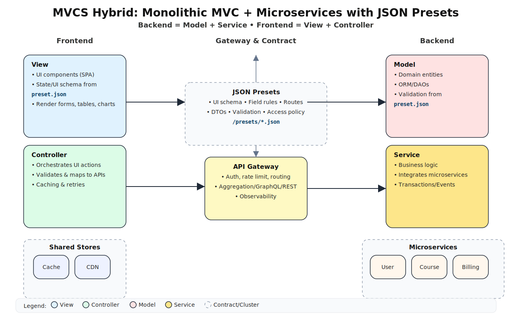

# MVCS Hybrid (Monolithic MVC + Microservices)

Preset berbasis **JSON** mengatur perilaku UI (komponen, rute, validasi) sekaligus memetakan endpoint **Service** dan skema data **Model** agar front-end bersifat *config-driven*.

---

## 1️⃣ Diagram Alir (Flow Diagram)



**Alur utama:**  
Client → Controller → Service → Model/DB ↔ Microservices → View  
Preset JSON menginjeksikan konfigurasi ke Controller & View.

---

## 2️⃣ Diagram Lingkaran Terbagi Dua (Backend vs Frontend)


| Posisi | Komponen |
|:-------|:----------|
| Atas-kiri | Model |
| Bawah-kiri | Service |
| Atas-kanan | View |
| Bawah-kanan | Controller |

---

## 3️⃣ Contoh JSON Preset

```json
{
  "app": {
    "name": "LMS MVCS",
    "theme": "auto",
    "routes": [
      {
        "path": "/courses",
        "view": "Table",
        "controller": "CourseCtrl",
        "service": {
          "list": "/api/courses",
          "detail": "/api/courses/:id"
        },
        "columns": [
          {"key": "code", "label": "Kode"},
          {"key": "title", "label": "Mata Kuliah"},
          {"key": "credits", "label": "SKS"}
        ]
      }
    ]
  }
}
